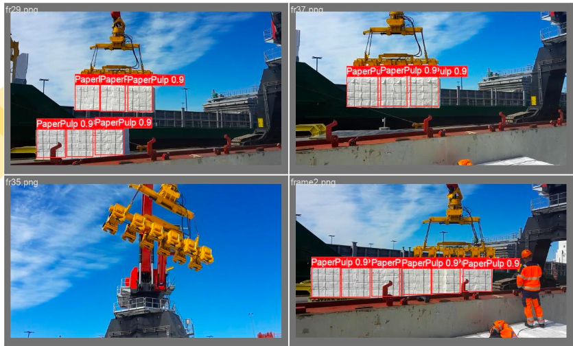
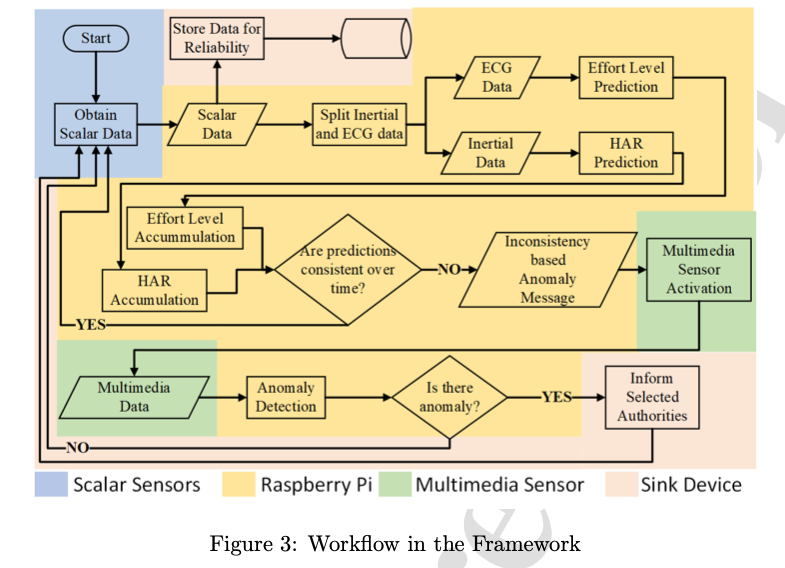
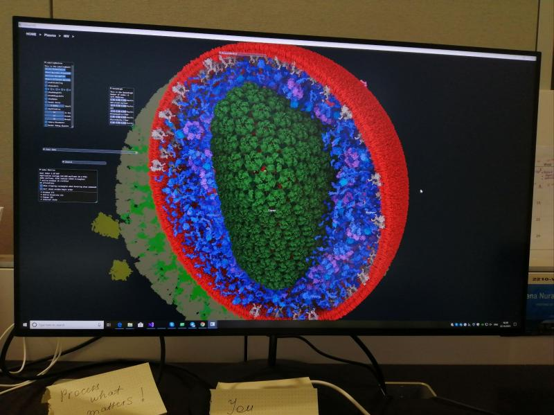
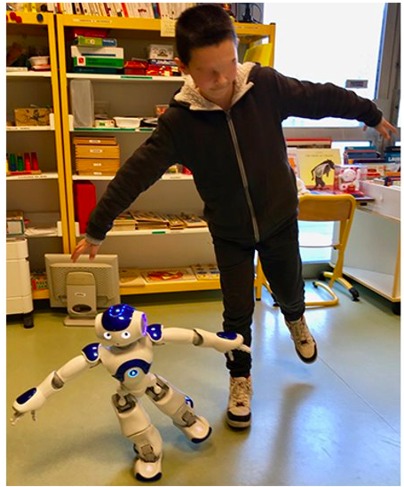
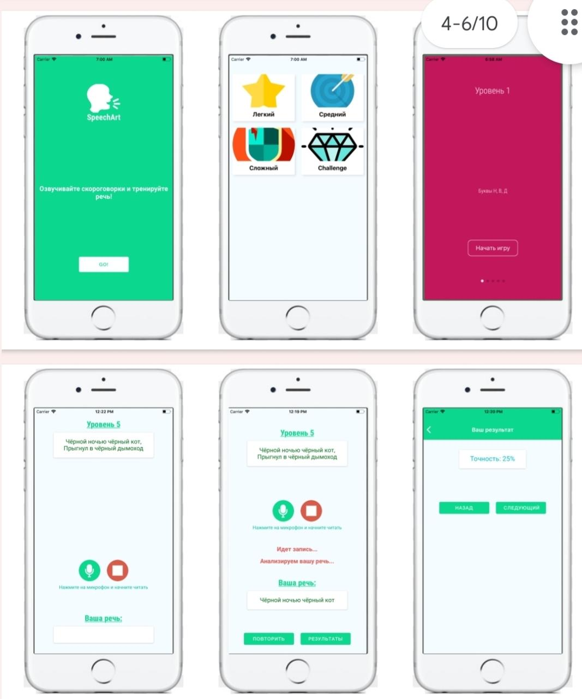
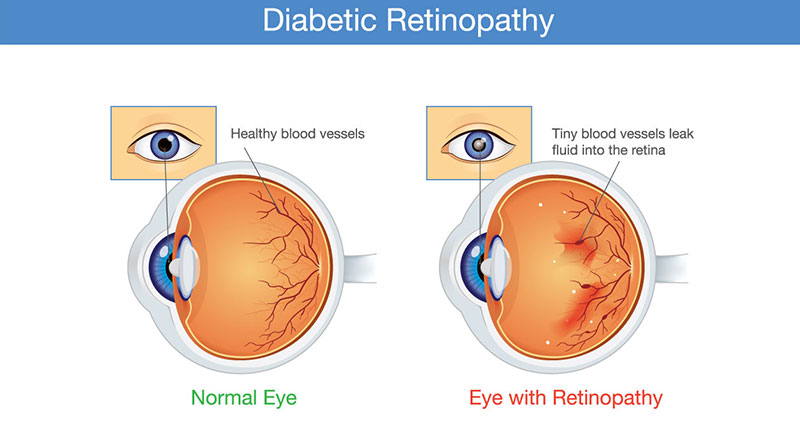
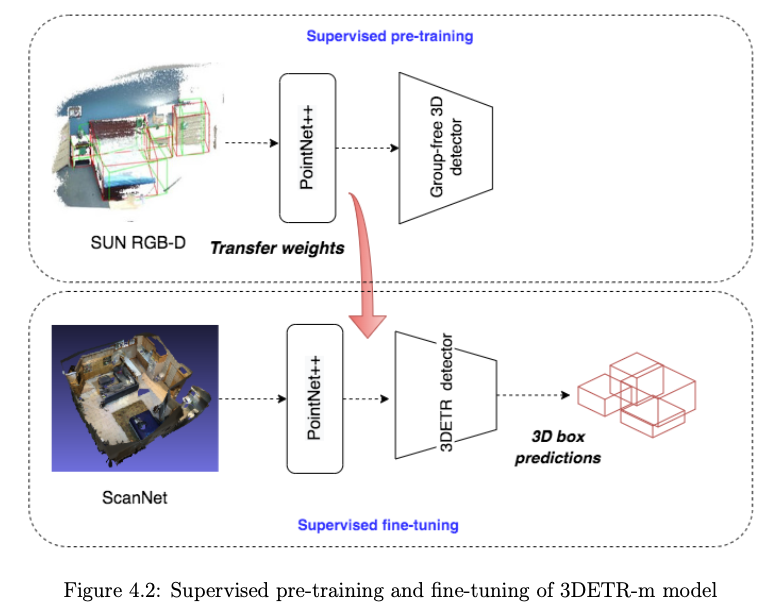

# Data Scientist

## About Me
I studied Computer Science in my bachelor degree at Nazarbayev University in Kazakhstan 🇰🇿. I did research in robotics 🤖 during my junior year and had my first paper published. I had summer internship at KAUST, Saudi Arabia in molecular visualization 🧬 and computer graphics. I participated in hackathons, did side projects and launched a React Native mobile app.  I completed MSc in Computer Vision at MBZUAI in Abu Dhabi and successfully defended my thesis 👩🏻‍🎓. My thesis result was accepted as a conference paper to VISAPP 2023 (part of VISSIGRAPP).

### Social Links
[LinkedIn](https://www.linkedin.com/in/nurakhmetova/)

[Google Scholar](https://scholar.google.com/citations?hl=en&user=yfIe898AAAAJ)

### Technical Skills
**Programming Languages:** Python, C/C++, Java, JavaScript

**Libraries:** PyTorch, TensorFlow, pandas, NumPy, Matplotlib, Scikit-learn, Seaborn, OpenCV, NLTK, spaCy, Streamlit

**Other:** MLOPs, ETL, Git, GitHub, Linux, REST APIs, SQL, Microsoft Azure, HuggingFace, HTML5/CSS3, OOP, Data Structures & Algorithms, Excel

**Key Words:** Machine Learning, Deep Learning, Neural Networks, Natural Language Processing, Transformers, Generative AI, Data Visualization, Data Analysis

**Computer Vision Tasks:** Object detection, object recognition, classification, counting, segmentation

**Machine Learning Tasks:** SHAPley values, X-AI, time-series anomaly detection, classification, regression, clustering

## Education
MSc in Computer Vision @ [Mohamed bin Zayed University of Artificial Intelligence](https://mbzuai.ac.ae)  (_Jan. 2021 – Jan. 2023_)
- Fully-funded Scholarship, CGPA: 3.67/4.0
- Coursework: Mathematical Foundations of AI, Human and Computer Vision, Visual Object Recognition and Detection, Geometry for Computer Vision, Deep learning
  
BSc in Computer Science @ [Nazarbayev University](https://nu.edu.kz) (_Jul. 2016 – Jun. 2020_)
- Fully-funded Scholarship, CGPA: 3.35/4.0
- Coursework: Software Engineering, Operating Systems, Algorithms, Artificial Intelligence, Database Systems, Machine Learning, Performance and Data Structures, System Design and Analysis.

## Work Experience
**Machine Learning Engineer Intern @ [TachyHealth](https://tachyhealth.com) (_June 2024 -- Present_)**
- Working on Sustainability and Explainability for Fraud Detection in Healthcare Systems

**Research Assistant @ [Zayed University](https://zu.ac.ae) (_June 2023 - September 2023_)** 
- Composed a survey paper on privacy and trust issues in blockchain and edge computing resource allocation
- Collaborated with a team to analyze and present data from 50+ surveys, leading to new research insights

**Machine Learning Engineer Intern (R&D) @ [FortyGuard](https://fortyguard.com) (_June 2023 – July 2023_)**
- Utilized OS-Climate platform to analyze climate data for efficient data pipeline design
- Assessed thermal comfort index datasets globally for indoor/outdoor environments

**Research Assistant @ [Mohamed bin Zayed University of Artificial Intelligence](https://mbzuai.ac.ae) (_February 2023 -- July 2023_)**
- Enhanced 3D detection performance of indoor scene objects using PyTorch and Transformer architecture
- Achieved significant improvement in small-size category detection: 3.51% (picture) and 1.4% (garbage bin)

**Computer Vision Engineer Intern @ [AD Ports Group](https://www.adportsgroup.com/), Maqta Gateway (_October 2022 -- December 2022_)**
- Worked on Automated Cargo Recognition and Counting System to improve the operational efficiency of the port
- Trained YOLOv5l model on custom dataset increasing accuracy from 95.9% to 98.8%

**Machine Learning Engineer @ [Nazarbayev University](https://nu.edu.kz/) (_January 2020 -- January 2021_)**
- Created an end-to-end ensemble of Random Forest Classifiers for time-series anomaly detection in health data
- Obtained at least 79% accuracy and 20% false positive rate. Published the article in Internet of Things journal

**Visiting Student Intern @ [King Abdullah University of Science and Technology](https://www.kaust.edu.sa/), NANOvis Group (_May 2019 -- November 2019_)**
- Worked on cell visualization and molecular graphics project
- Developed an automated traversal of a 3D scene of HIV virus structures (RNA, DNA, protein cells) using C++ and Qt framework

**Front-End Software Engineer Intern @ [KazDream Technologies LLC](https://www.kazdream.kz) (_February 2019 -- March 2019_)**
- Implemented a login page, input validations, and a date-picker of the website using JavaScript, HTML5/CSS3, Vue.js. Logged outputs in GitLab, reviewed and fixed codes. Captured data from 3rd party APIs

**Undergraduate Researcher @ [Nazarbayev University](https://nu.edu.kz/), Robotics Lab (_September 2018 -- December 2018_)**
- Developed an [Android tablet app](https://github.com/Aydana1/Android_App_Nao_RemoteControl) in Java for medical staff to interact with a humanoid robot NAO to assist children with autism spectrum disorder. Established TCP connection between a tablet and  Choregraphe software

**Mobile Developer @ [nFactorial School](https://www.nfactorial.school/) (_June 2018 -- August 2018_)**
- Created a React Native app [SpeechArt](https://github.com/Aydana1/SpeechArt)(1000+ downloads on Play Store) for correcting speech defects with tongue-twisters and became one of 6 finalists out of 100

## Projects
### [PDF Sentiment Analyzer](https://github.com/Aydana1/NLP_Sentiment_analysis) | _Python, Streamlit, tabula, pandas, NLTK, spaCy, HuggingFace, Transformers_

Sentiment analysis web interface using VaderSentiment with text parsed from pdf file uploaded to local host 

### [Blood Cells Classification and Localization](https://github.com/Aydana1/Enhancing_YOLOv5l) | _Python, PyTorch, Git, Yolov5_

Obtained 4.3% mAP on top of the baseline reducing inference speed by 1.7 ms. Solved the overlapping issue of red blood cells 

### [Large-Scale Aerial Image Recognition](https://drive.google.com/file/d/1v2-A-zfaRUac3rxw5UuM6IUqNB0qE0c7/view?usp=sharing) | _Python, PyTorch, Detectron2, Git_

Fine-tuned Faster R-CNN using Detectron2 framework and increased mAP of small objects by 1.9% on a large-scale aerial dataset

### [Efficient Human Pose Estimation](https://mbzuaiac-my.sharepoint.com/:p:/g/personal/fatima_albreiki_mbzuai_ac_ae/ET2Fa51ZLStCgRFH_NYfdbgB2Uoqm2YxpkeXx-cd8_rvng?e=lqwldkhttps://github.com/Aydana1/TrainTicketing) | _Python, PyTorch_ 

Changed original Stacked Hourglass architecture by adding dilated and depthwise convolution filters in the ResNet Bottleneck. Improved the training speed by 25%

### Retinal eye disease detection with Convolutional Neural Networks

Experimented with various CNN networks such as LeNet, ResNet variants (ResNet32, ResNet50, ResNet101), VGG in PyTorch

### [Train Ticket Reservation](https://github.com/Aydana1/TrainTicketing) | _Java, SQL, MySQL, Git, GUI_

Database Systems course project: desktop app for reserving tickets for a train seat using Java and SQL

## Awards & Scholarships
- 1st place in Pioneers Industry 4.0 Data Science Hackathon, [EDGE and MoIAT of UAE](https://edgegroup.ae/news/ministry-industry-and-advanced-technology-and-edge-launch-pioneers-40-hackathon-series-advance), November 2022
- 3rd place in ‘AI for Good’ Hackathon, Microsoft & NU, March 2019
- Big Data workshop by CS Prof. at Stanford, Jennifer Widom, NU, September 2019
- Finalist of Mobile App Dev. Bootcamp @ [nFactorial School](https://www.nfactorial.school/), June - August 2018
- Bertelsmann Data Science Scholarship program, Udacity, May 2018

## Publications
- Nurakhmetova, A.; Lahoud, J. and Cholakkal, H. (2023). _Data-Efficient Transformer-based 3D Object Detection_. In Proceedings of the 18th International Joint Conference on Computer Vision, Imaging and Computer Graphics Theory and Applications (VISIGRAPP 2023) - Volume 4: VISAPP; SciTePress, pages 615-623. [Link](https://doi.org/10.5220/0011673200003417)

- Yazici, A., Zhumabekova, D., Nurakhmetova, A., Yergaliyev, Zh., Yatbaz, H. Y.,  Makisheva, Z., Lewis, M. & Ever, E. (2023). _A Smart e-Health Framework for Monitoring the Health of the Elderly and Disabled_. Internet of Things, Volume 24. [Link](https://doi.org/10.1016/j.iot.2023.100971)
- Sandygulova, A., Zhexenova, Z., Tleubayev, B., Nurakhmetova, A., Zhumabekova, D., Assylgali, I., Rzagaliyev, Y. \& Zhakenova, A. (2019). _Interaction design and methodology of robot-assisted therapy for children with severe ASD and ADHD_. Paladyn, Journal of Behavioral Robotics, 10(1), 330-345. [Link](https://doi.org/10.1515/pjbr-2019-0027)

## Certifications
- [Improving Deep Neural Networks: Hyperparameter tuning, Regularization and Optimization](https://www.coursera.org/account/accomplishments/verify/9MB8V8BM8FKL) (Coursera)
- [Neural Networks and Deep Learning](https://coursera.org/share/fdb61da55276c3e9bcf31bdda4d48f2f) (Coursera)
- Bertelsmann Data Science Scholarship program (Udacity)
- Web Developer BootCamp (Udemy)
- [Python Object Basics: Functions, Recursion, and Objects](https://coursera.org/share/c445d5a4b433433c97d3fa10d85d1abf) (Coursera)
- [Python Data Structures](https://coursera.org/share/20e0d86355ac4bb3ec6465512e623d8f) (Coursera)
